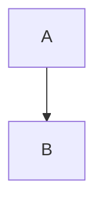

# make-docx-file

## Overview

Create a high-quality `.docx` document **via Markdown as the source of truth**.

You MUST:
- Produce a **descriptive base name** for outputs (not generic like `report`). If the user didn’t provide one, ask for it. If the user truly doesn’t care, infer one from topic + date and state it before writing files.
- First create `<base>.md` with the full content.
- Convert Mermaid diagrams to images via Kroki at `http://localhost:8000` and embed them in the Markdown.
- Convert the (diagram-rendered) Markdown to `<base>.docx` using pandoc with explicit Markdown/math extensions.
- Escape Markdown characters that commonly break conversion (especially literal `$`).

## When to Use

Use this skill when the user asks for:
- A Word document / `.docx`
- A report, memo, brief, or document that must be delivered as `.docx`
- A document containing math or Mermaid diagrams that must render correctly in `.docx`

## Inputs to Confirm (fast)

Before writing files, ensure you know:
- **Base name**: the desired output base filename (example: `incident-postmortem-2026-02-23`)
- **Title/sections**: what the document should contain (or infer from the user’s request)
- **Math**: whether math is present and whether it uses `$...$`, `$$...$$`, `\(...\)`, or `\[...\]` (support all)
- **Diagrams**: whether Mermaid diagrams are needed

## Instructions

### 1) Choose a descriptive `<base>` name (required)

Rules:
- `<base>` MUST be specific and descriptive (topic + optional date).
- Output files MUST be named exactly:
  - `<base>.md`
  - `<base>.rendered.md` (after Mermaid replacement)
  - `<base>.docx`

### 2) Write `<base>.md` first (source of truth)

Create a new Markdown file in the user’s **current directory** with the full content.

Authoring rules:
- Use headings, lists, and tables normally.
- For code/shell snippets containing `$`, prefer fenced code blocks to avoid accidental math parsing.
- For math, use any of:
  - Inline: `$...$` or `\(...\)`
  - Display: `$$...$$` or `\[...\]`

### 3) Escape/preflight to avoid pandoc errors (especially `$`)

Pandoc enables TeX-style math parsing when math extensions are on. To avoid surprises:
- If a dollar sign is **literal** (currency, environment variables, etc.), write it as `\$` or put the whole snippet in a code span/block.
- Ensure `$...$` math is **balanced** (no stray/unmatched `$`).
- Keep raw TeX commands inside math blocks when possible.

### 4) Convert Mermaid blocks to images via Kroki and embed

For every Mermaid diagram in `<base>.md`:
- Represent it as a fenced block:

````markdown

````

- Render it to a PNG via Kroki at `http://localhost:8000`.
- Replace the Mermaid block with a Markdown image that will become a figure in the `.docx`.
- Keep the **Mermaid source as a small caption** on the image (compact/minified is fine).

Use the bundled script (recommended):

- From the repository root:
  - `uv run agent-skills/make-docx-file/scripts/render_mermaid.py "<base>.md" --output "<base>.rendered.md" --kroki-url "http://localhost:8000" --out-dir "generated/diagrams"`

If there are no Mermaid blocks, you can set `<base>.rendered.md` to be identical to `<base>.md`.

### 5) Convert Markdown to `.docx` with pandoc (math + features enabled)

Run pandoc from the directory containing the markdown file:

- **Input**: `<base>.rendered.md`
- **Output**: `<base>.docx`

Use an explicit `--from` with extensions so math and common Markdown features are interpreted consistently:

- `pandoc "<base>.rendered.md" -o "<base>.docx" --from "markdown+tex_math_dollars+tex_math_single_backslash+raw_tex+fenced_code_blocks+pipe_tables+link_attributes+implicit_figures" --resource-path=".:generated/diagrams"`

Notes:
- `implicit_figures` helps ensure standalone images become Word figures with captions.
- `--resource-path` must include the diagram output directory so pandoc can find the PNGs.

### 6) Validate and iterate

After conversion:
- Confirm `<base>.docx` exists.
- If pandoc fails:
  - Re-check literal `$` and unbalanced math delimiters.
  - Ensure Mermaid images were created and paths are correct.
  - Re-run the Mermaid rendering step, then pandoc again.

## Output requirement

You MUST:
- Create the files (don’t just describe them).
- In your final response, report the filenames created: `<base>.md`, `<base>.rendered.md`, `<base>.docx`.
